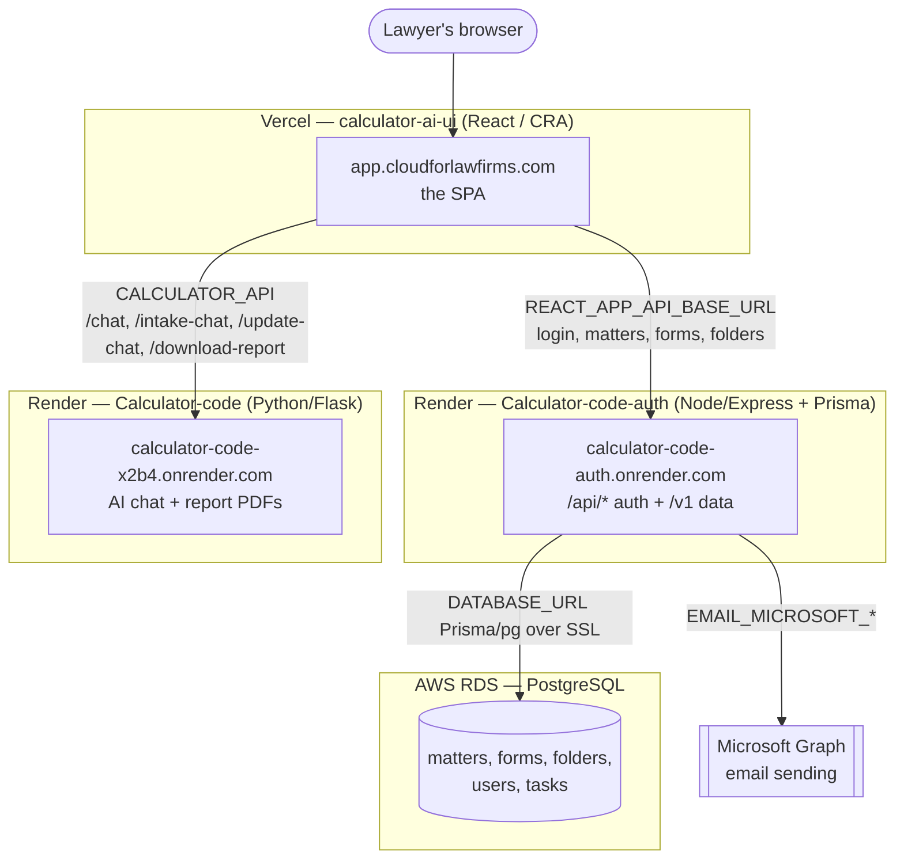
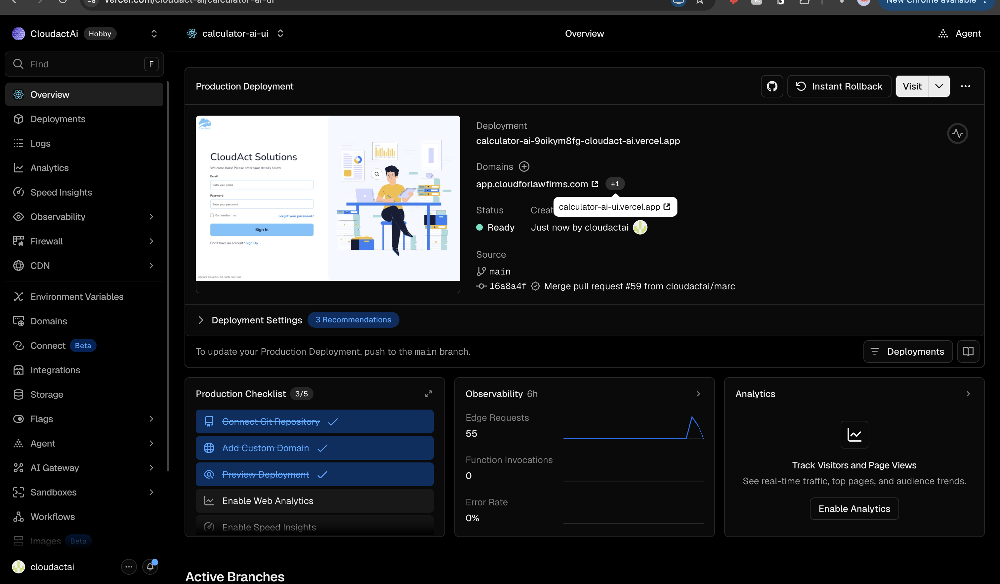
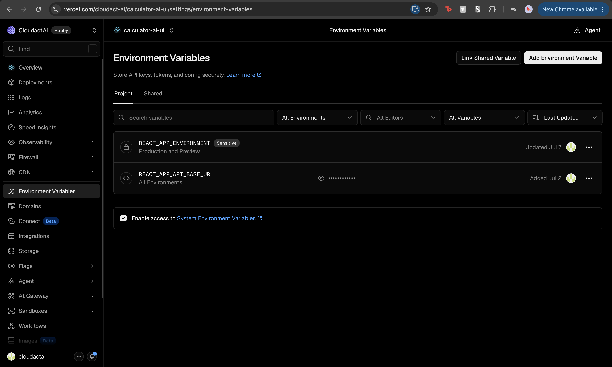
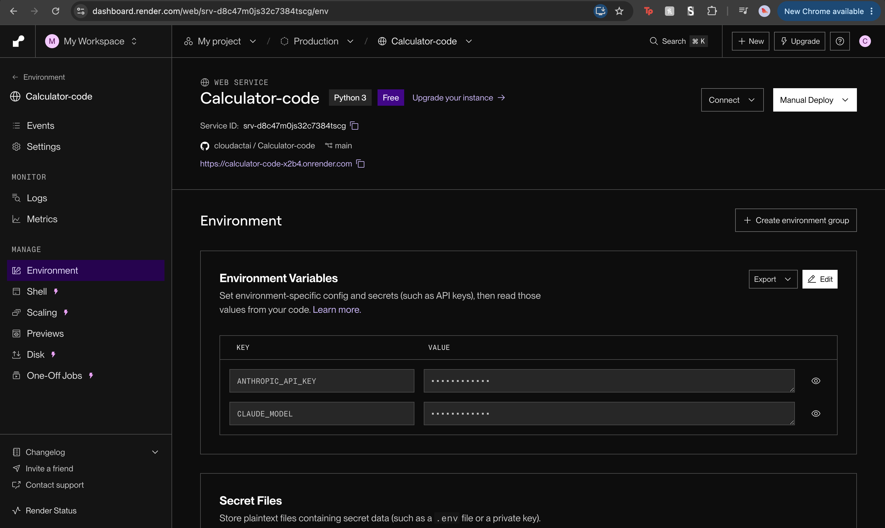
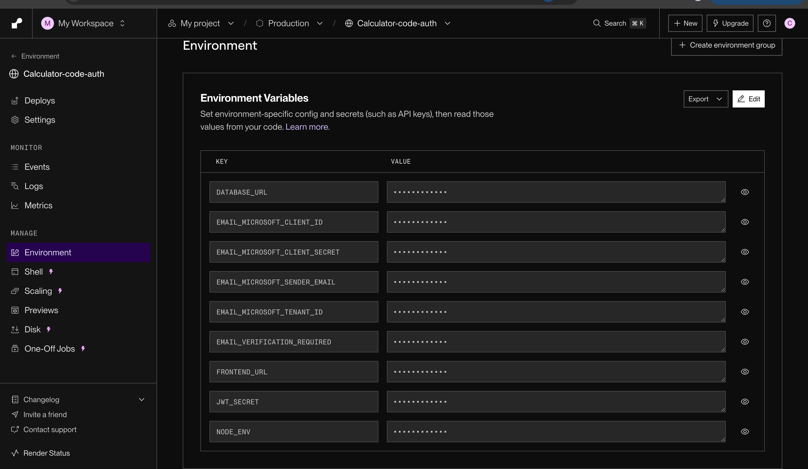

# Repository architecture & deployment

This document maps the whole system: what each piece is, where it runs, how the pieces
communicate, what each environment variable does, and where to look when something
breaks. Read it first if you are new to the project, or if you need to work out which
service is failing.

> **About the screenshots.** This document uses four dashboard screenshots, stored in
> [images/](images/):
>
> | File | What it shows |
> |---|---|
> | `render-flask-env.png` | Render → **Calculator-code** (Flask) → Environment |
> | `vercel-overview.png` | Vercel → **calculator-ai-ui** → Overview |
> | `render-auth-env.png` | Render → **Calculator-code-auth** (Node) → Environment |
> | `vercel-env.png` | Vercel → **calculator-ai-ui** → Environment Variables |
>
> Each caption below describes its screenshot in full, so the text stands on its own if
> the images do not render.

---

## The big picture

The system has **four** parts, plus the git repo. Three are hosted services; one is a
database.

| Piece | Tech | Host | In this repo | Public URL |
|---|---|---|---|---|
| **Frontend UI** | React (create-react-app) | **Vercel** (`calculator-ai-ui`) | [cloudact-ui/](../cloudact-ui/) | `app.cloudforlawfirms.com` (+ `calculator-ai-ui.vercel.app`) |
| **Auth + data API** | Node.js / Express 5 / Prisma | **Render** (`Calculator-code-auth`) | [auth-server/](../auth-server/) | `calculator-code-auth.onrender.com` |
| **AI / report backend** | Python / Flask / gunicorn | **Render** (`Calculator-code`) | [app.py](../app.py) + calculators | `calculator-code-x2b4.onrender.com` |
| **Database** | PostgreSQL | **AWS RDS** | schema in [auth-server/prisma/](../auth-server/prisma/) | (private, via `DATABASE_URL`) |

Everything deploys from the **`main`** branch of `cloudactai/Calculator-code`. In the
screenshots all three services are on the same commit (`e6e814b`, "Merge pull request
#58 from cloudactai/marc"). Matching commit hashes across the three services is what a
fully in-sync deployment looks like.

---

## 1. Frontend — Vercel (`calculator-ai-ui`)

The React SPA (built from [cloudact-ui/](../cloudact-ui/)). It provides the CloudAct
Solutions sign-in and the whole application the lawyer uses (Matters, Forms,
calculators). Key details from the Overview screenshot:

- **Project:** `calculator-ai-ui` under the **CloudactAi** Vercel team (Hobby plan).
- **Production domain:** `app.cloudforlawfirms.com` (with `calculator-ai-ui.vercel.app`
  as the Vercel-generated alias).
- **Deploys on push to `main`** — "To update your Production Deployment, push to the
  main branch." Each merged PR triggers a build.
- This is a **create-react-app** build, not Vite. That distinction matters: env vars are
  `process.env.REACT_APP_*`, inlined **at build time**. Changing an env var in Vercel
  does nothing until you **redeploy**.
- SPA routing is handled by [vercel.json](../vercel.json), which rewrites every path to
  `/index.html` so client-side React Router works on refresh.

> **Hobby-plan limitation:** only commits by the account owner deploy automatically. If
> a teammate's merge does not deploy ("commit author does not have contributing
> access"), the owner has to push or redeploy manually, or the team upgrades to Pro.

### Frontend environment variables

Only two are set (screenshot 4). That is intentional: the frontend falls back to
sensible defaults in [cloudact-ui/src/config.ts](../cloudact-ui/src/config.ts) and
[cloudact-ui/src/utils/dataAxios.js](../cloudact-ui/src/utils/dataAxios.js):

| Variable | Purpose |
|---|---|
| `REACT_APP_API_BASE_URL` | Base URL of the **auth-server** (the Node service). Everything the app loads/saves — login, matters, forms, folders, task states — goes here. `dataAxios.js` normalizes it to the `/v1` data API and the same host serves `/api/*` for auth. If unset in production it falls back to `https://calculator-code-auth.onrender.com/v1`. |
| `REACT_APP_ENVIRONMENT` | Build environment tag: `DEV` / `QA` / `PROD` / `LOCAL` (marked *Sensitive*). Read in `config.ts`; selects which environment profile the app assumes. |

Two more that are **not** set here but exist as optional overrides in `config.ts`:

- `REACT_APP_CALCULATOR_API_URL` → the **Flask** backend. Unset, so it uses the baked-in
  default `https://calculator-code-x2b4.onrender.com`. This is the `CALCULATOR_API`
  the AI chat panels and report download use.
- `REACT_APP_SETUP_WIZARD_API_URL` → a legacy Report-Creation Node backend
  (`report-creation.onrender.com`), only used by the setup wizard.

> **Known documentation mismatch:** the older handoff note
> [AUTH_HANDOFF/ENV_VARS.md](AUTH_HANDOFF/ENV_VARS.md) refers to `VITE_*` variables and
> "Render Postgres". It was written for a Vite build against a Render database. The
> **current** app uses **CRA (`REACT_APP_*`)** and an **AWS** database. Where the two
> disagree, this document and the screenshots are correct.

---

## 2. AI / report backend — Render (`Calculator-code`, Flask)

The Python service ([app.py](../app.py), started with `web: gunicorn app:app` via
[Procfile](../Procfile)). It handles every conversational feature and every generated
PDF: the child and spousal support calculators, the matter-intake agent, the
update-information agent, and the downloadable reports. It is **stateless** and calls
only Anthropic; it does **not** touch the database (all saving is done by the frontend
calling the auth-server). That is why even the update agent returns its changes as
patches for the frontend to write, rather than saving them itself. From the screenshot:

- **Service name:** `Calculator-code` · **Type:** Web Service · **Runtime:** Python 3 ·
  **Instance:** **Free**.
- **Service ID:** `srv-d8c47m0js32c7384tscg`.
- **Public URL:** `https://calculator-code-x2b4.onrender.com` (this is the frontend's
  `CALCULATOR_API` default).
- Deploys from `cloudactai/Calculator-code`, branch `main`.

### Its environment variables

| Variable | Purpose |
|---|---|
| `ANTHROPIC_API_KEY` | Credential for the Anthropic API. Every chat and report call uses it. If it is missing, expired, or over quota, **all** AI features fail: chat replies return errors and reports do not generate. |
| `CLAUDE_MODEL` | Which Claude model to call. Read in `app.py` as `os.getenv("CLAUDE_MODEL", "claude-sonnet-4-6")` — so if unset it defaults to `claude-sonnet-4-6`. Set it here to pin/upgrade the model without a code change. |

> **Free-instance cold starts.** A Free Render web service goes to sleep when idle and
> takes roughly 30–60 seconds to start again. That is why the chat panels show
> *"Warming up the server — first reply can take ~30s…"* and why the frontend axios
> timeout is 75s ([utils/axios.js](../cloudact-ui/src/utils/axios.js)). A slow **first**
> message after a quiet period is expected behaviour, not a fault.

---

## 3. Auth + data API — Render (`Calculator-code-auth`, Node)

The Node/Express + Prisma service ([auth-server/](../auth-server/), entry
[auth-server/server.js](../auth-server/server.js)). This is the **only** service that
reads and writes the database. It serves two groups of routes:

- `/api/*` — accounts & sessions: signup, login, verify-email, forgot/reset password,
  `/api/me`, logout. Sessions are JWTs in a cross-domain cookie.
- `/v1/*` — the app data: matters, forms, folders, task states, form-template PDFs
  (everything [cloudact-ui/src/services/formsService.js](../cloudact-ui/src/services/formsService.js)
  and the matter Redux actions call).

From the screenshot: **Service ID** `srv-d939g4vavr4c73bma26g`, name
`Calculator-code-auth`. Its **start command** runs migrations then boots:
`npx prisma migrate deploy && node server.js` (see [package.json](../auth-server/package.json)).

### Its environment variables

| Variable | Purpose |
|---|---|
| `DATABASE_URL` | Postgres connection string → the **AWS RDS** database (see §4). Prisma/`pg` connect through it; SSL is auto-enabled for `*.rds.amazonaws.com` hosts ([prismaClient.js](../auth-server/prismaClient.js)). This is the most critical secret in the system: if it is wrong or expired, the app cannot load or save any data. |
| `JWT_SECRET` | Long random secret that signs session JWTs. **Rotating it logs everyone out.** |
| `FRONTEND_URL` | The exact Vercel origin (`https://app.cloudforlawfirms.com`, no trailing slash). Used for **CORS** *and* as the base of links in verification/reset emails. |
| `NODE_ENV` | Must be `production` in production. Otherwise the browser drops the cross-domain session cookie and logins do not persist, with no visible error. |
| `EMAIL_MICROSOFT_TENANT_ID` | Microsoft Graph (Entra) tenant ID — used to **send** transactional email (verify, reset). |
| `EMAIL_MICROSOFT_CLIENT_ID` | The Graph app-registration client ID. |
| `EMAIL_MICROSOFT_CLIENT_SECRET` | The Graph app client secret. **This one expires** (see the caveat below). |
| `EMAIL_MICROSOFT_SENDER_EMAIL` | The from-address, `notifications@cloudforlawfirms.com`. |
| `EMAIL_VERIFICATION_REQUIRED` | `true`/`false` — whether new signups must verify email before use. `false` is a dev convenience, not a login bypass. |

> **Email uses Microsoft Graph.** The four `EMAIL_MICROSOFT_*` values authenticate an
> app-only (client-credentials) Microsoft Graph call with `Mail.Send` on the shared
> mailbox. That is how the auth-server sends verification and reset email. A **separate**
> document will cover the Graph email flow in detail. For the purposes of this document,
> treat these four variables as the email sender's credentials; they were copied from the
> older `report-creation` Render service.
>
> **Shared-secret warning:** the client secret is currently shared with that other
> service, so when it expires **both** services stop sending email at the same time. The
> symptom is `Microsoft Graph token request failed: 401` in the logs. Record the expiry
> date and set a reminder.

---

## 4. Database — AWS RDS (PostgreSQL)

The database is **PostgreSQL on AWS RDS**, reached only by the auth-server via
`DATABASE_URL`. The schema is Prisma-managed:

- Schema: [auth-server/prisma/schema.prisma](../auth-server/prisma/) — `datasource db`
  is `provider = "postgresql"`, `url = env("DATABASE_URL")`.
- Connection: [auth-server/prismaClient.js](../auth-server/prismaClient.js) wires Prisma
  through the `pg` `Pool`, and **auto-enables SSL** when the host matches
  `*.rds.amazonaws.com` (also `*.render.com` / `*.neon.tech`).
- Migrations are applied on every deploy by the start command
  (`npx prisma migrate deploy`).

It holds users/sessions plus all matter data: matters, intake sections, forms,
folders, and per-matter task states.

### If the AWS database credential/token "expires"

The connection string is a standard user/password (+ SSL) URL, so nothing expires on a
timer *inside the app*. A failure means the credential in `DATABASE_URL` stopped
working at the AWS side — a **rotated master password**, a **revoked/expired IAM
database-auth token** (if IAM auth is used, those are valid ~15 min and must be
regenerated), an RDS endpoint change, or the security group/SSL requirement changing.

**How to recognise it (symptoms, working from the outside in):**

1. In the **browser**, the app loads the shell but Matters/Forms show "Unable to
   load…", and network calls to `…/v1/*` return **500** (not 401 — a 401 is a
   *login/session* problem, i.e. `JWT_SECRET`/cookie, not the DB).
2. In the **auth-server Render logs** (see the logs section below) you will see Prisma
   or `pg` connection errors — for example `password authentication failed for user`,
   `no pg_hba.conf entry`, `SSL required`, `getaddrinfo ENOTFOUND …rds.amazonaws.com`,
   or connection timeouts. The Flask service and its AI chat keep working, because they
   have no database connection; that is a quick way to confirm the fault is limited to
   the database.
3. If the start command cannot migrate, the **deploy itself fails** at
   `prisma migrate deploy`.

**Where to fix it:** update `DATABASE_URL` in **Render → Calculator-code-auth →
Environment** with the new/rotated credential (or a freshly minted IAM token), verify
the RDS endpoint/port and that its security group allows Render's egress, and redeploy.

> The exact AWS authentication mechanism (static password, IAM database authentication,
> or Secrets Manager rotation) is not recorded in this repo. Confirm which one this RDS
> instance uses, so the steps above can name the precise way to regenerate the
> credential. The symptoms, and the "update `DATABASE_URL` and redeploy" fix, apply
> either way.

---

## Where to look for logs

| What you are debugging | Where to look |
|---|---|
| A page not loading, a save failing, login problems, **database errors** | **Render → Calculator-code-auth → Logs** (and **Events** for deploy and crash history). This is the busiest log. |
| AI chat not replying, report PDF not generating, Anthropic or model errors | **Render → Calculator-code → Logs**. Look for Anthropic 401/429 responses or model-name errors. |
| Email not arriving (verification or reset) | **Render → Calculator-code-auth → Logs**, searching for `Microsoft Graph`. A `401` there means an expired `EMAIL_MICROSOFT_CLIENT_SECRET`. |
| Build failed, wrong env var built in, routing or 404 on refresh | **Vercel → calculator-ai-ui → Deployments** (build logs) and **Logs/Observability** (runtime and edge). Remember that CRA inlines env vars at build time, so rebuild after changing them. |
| Slow first request after an idle period | Expected Free-tier cold start on the Render services. Check **Events** to confirm the service is starting up rather than crashing. |
| Database-level problems (slow queries, storage, connections) | **AWS RDS console** → the instance's **Monitoring**/CloudWatch and **Logs & events**. |

Both Render services also have **Shell** and **Metrics** tabs. The auth-server's Shell
is useful for running one-off Prisma commands against the live database.

---

## How a request actually flows

- **Sign in / load matters / save a form** → browser → `REACT_APP_API_BASE_URL`
  (auth-server on Render) → Prisma → **AWS RDS**. Response comes back through the same
  chain.
- **Ask the AI / download a support report** → browser → `CALCULATOR_API` (Flask on
  Render) → Anthropic → PDF/text back. **No database involved.**
- **Sign up / reset password** → auth-server writes the user + calls **Microsoft
  Graph** to email the link (whose base is `FRONTEND_URL`).

This gives a useful first check: **if the AI chat works but data will not load, the
problem is the auth-server or the database; if data loads but the AI does not respond,
the problem is the Flask service or Anthropic.**

---

## Deploying

1. Merge to **`main`** on `cloudactai/Calculator-code`.
2. **Vercel** auto-builds the frontend from `cloudact-ui/`.
3. **Render** builds both backend services from the same repo (each service has its own
   root and branch configuration). The auth-server runs `prisma migrate deploy` on
   start-up. You can also trigger a **Manual Deploy** from each Render service.
4. Final check: the commit hash shown as **Live** on both Render services and as the
   **Production Deployment** on Vercel should match (all three were `e6e814b` in the
   screenshots).

---

## Quick reference

| Thing | Value |
|---|---|
| Repo | `cloudactai/Calculator-code`, branch `main` |
| Frontend (Vercel) | `calculator-ai-ui` → `app.cloudforlawfirms.com` |
| Auth/data API (Render) | `Calculator-code-auth` → `calculator-code-auth.onrender.com` · `srv-d939g4vavr4c73bma26g` |
| AI/report API (Render) | `Calculator-code` → `calculator-code-x2b4.onrender.com` · `srv-d8c47m0js32c7384tscg` |
| Database | PostgreSQL on **AWS RDS** (via `DATABASE_URL`) |
| Email | Microsoft Graph (`EMAIL_MICROSOFT_*`), sender `notifications@cloudforlawfirms.com` |

See also: [MATTERS.md](MATTERS.md), [FORMS.md](FORMS.md), [DATABASE.html](DATABASE.html)
(every table and column, rendered — open it in a browser), and the auth handoff notes in
[AUTH_HANDOFF/](AUTH_HANDOFF/).
